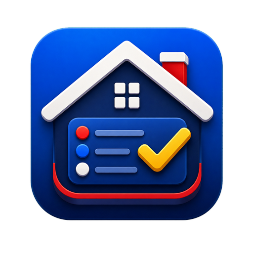
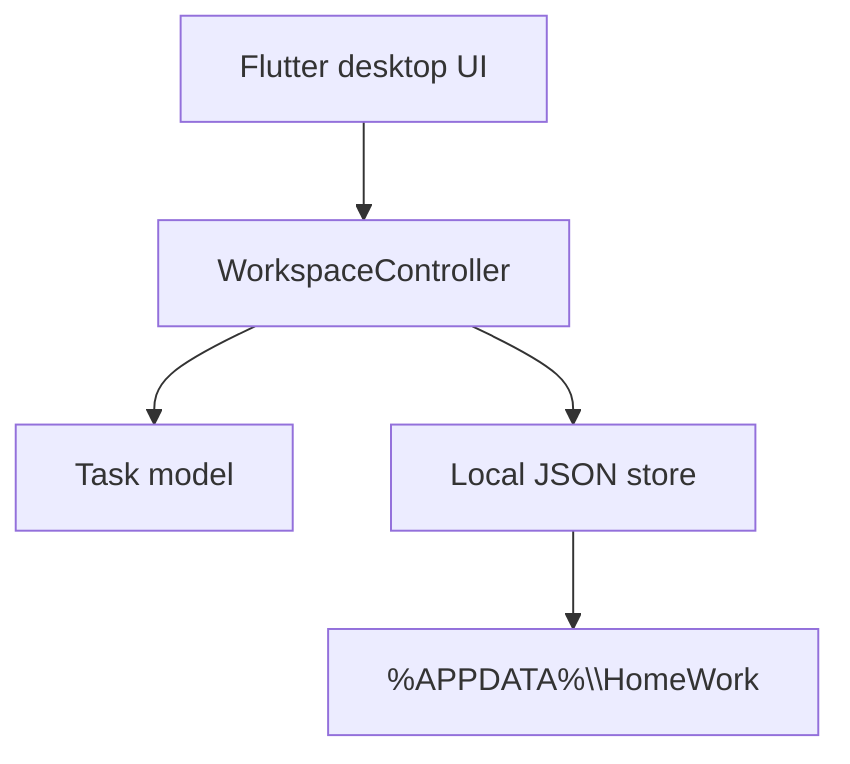

<p align="center">
  
</p>

<h1 align="center">HomeWork</h1>

<p align="center">
  Không gian làm việc cá nhân gọn nhẹ, riêng tư và chạy tốt trên Windows.
</p>

<p align="center">
  <a href="https://github.com/Base27-CVNSS/HomeWork/actions/workflows/windows-release.yml"></a>
  <a href="https://github.com/Base27-CVNSS/HomeWork/releases/latest"></a>
  
  
  <a href="LICENSE"></a>
</p>

HomeWork giúp gom công việc cá nhân, gia đình, học tập và công việc vào một màn hình desktop rõ ràng. Ứng dụng không yêu cầu đăng nhập, không cần máy chủ và lưu dữ liệu ngay trên máy của bạn.

## Cài đặt trên Windows

| Gói tải về | Dành cho ai | Cách chạy |
|---|---|---|
| **`HomeWork-Setup.exe`** | Khuyên dùng | Tải về, nhấp đúp và chọn **Install**. Ứng dụng tự tạo lối tắt và mở ngay sau khi cài. |
| **`HomeWork-Windows-Portable.zip`** | Không muốn cài đặt | Giải nén toàn bộ, rồi nhấp đúp **`HomeWork.exe`**. |

Tải bản mới nhất tại [GitHub Releases](https://github.com/Base27-CVNSS/HomeWork/releases/latest).

> Windows SmartScreen có thể hiện cảnh báo ở bản chưa ký số. Chọn **More info → Run anyway** nếu tệp được tải từ trang Releases chính thức của kho này.

## Tính năng

- Bảng tổng quan: số việc đang làm, đến hạn hôm nay và đã hoàn thành.
- Quản lý công việc theo hạn, mức ưu tiên và bốn nhóm dự án.
- Bộ lọc Tất cả / Hôm nay / Đang làm / Hoàn thành.
- Theo dõi tiến độ từng khu vực: Gia đình, Cá nhân, Công việc, Học tập.
- Dòng thời gian hoạt động và giao diện sáng/tối.
- Lưu tự động dưới dạng JSON tại `%APPDATA%\HomeWork\workspace.json`.
- Hoạt động hoàn toàn ngoại tuyến; không thu thập telemetry.

## Kiến trúc

HomeWork là bản viết lại sạch bằng Flutter, tách biệt hoàn toàn dữ liệu tham chiếu và mã dịch ngược khỏi đường build công khai.



Chi tiết nằm trong [docs/ARCHITECTURE.md](docs/ARCHITECTURE.md).

## Chạy mã nguồn

Yêu cầu: Windows 10/11 x64, Flutter stable và Visual Studio 2022 với workload **Desktop development with C++**.

```powershell
git clone https://github.com/Base27-CVNSS/HomeWork.git
cd HomeWork
.\tooling\bootstrap_windows.ps1
flutter run -d windows
```

Kiểm tra trước khi gửi thay đổi:

```powershell
dart format lib test
flutter analyze
flutter test
flutter build windows --release
```

## Tạo bản phát hành

Workflow `Windows Release` tự động kiểm thử, build Windows x64, tạo installer Inno Setup và portable ZIP. Để phát hành phiên bản mới:

```powershell
git tag v1.0.0
git push origin v1.0.0
```

Hai gói cài đặt sẽ tự được gắn vào GitHub Release tương ứng.

## Quyền riêng tư và an toàn

- Không hard-code access token, refresh token, API endpoint hay tài khoản thử nghiệm.
- Không đưa APK/XAPK, mã dịch ngược hoặc tài nguyên sở hữu của ứng dụng cũ vào kho.
- Khi tệp dữ liệu bị lỗi, HomeWork sao lưu tệp đó trước khi khởi tạo không gian mới.

Xem chính sách báo lỗi bảo mật tại [SECURITY.md](SECURITY.md).

## Đóng góp

Đọc [CONTRIBUTING.md](CONTRIBUTING.md) trước khi mở pull request. Dự án phát hành theo giấy phép [MIT](LICENSE).
